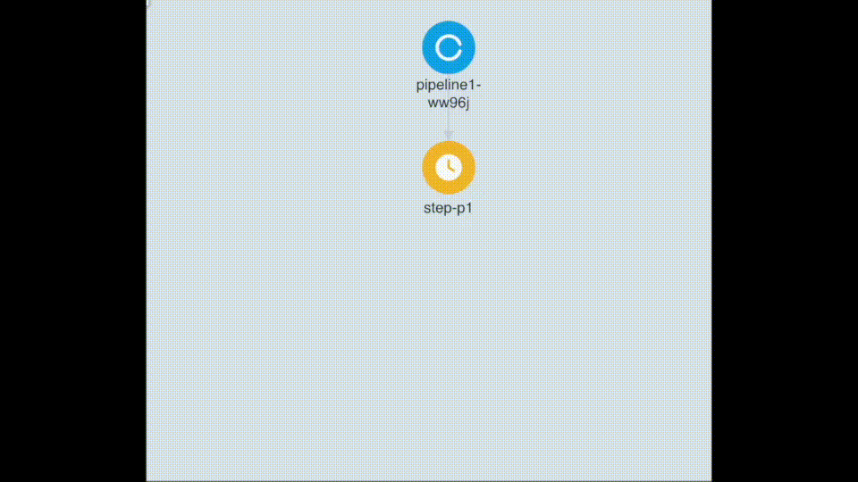

#
<p align="center">
  
</p>

<p align="center">
    <a href="#"></a>
    <a href="https://discord.gg/KxHPMsBdyp" target="_blank"></a>
</p>

🌟 **With Paradigm, you ML code is production-ready from the beginning**

Paradigm is a light-weight, lightning-fast, supremely adaptable tool, effortlessly packaging your ML code into robust pipelines for seamless deployment on Kubernetes. Bypass the need for code refactoring as Paradigm intelligently interprets your Python notebooks and scripts, priming them for scalable production. Paradigm is your ultimate ally in ML deployment, merging unparalleled speed, adaptability, and simplicity into one package.

## Paradigm in Action
### Terminal View


### DAG View



## Deploy an ML pipeline in just 2 steps

```console
$ paradigm launch --step <your-project-notebooks-or-scripts>
$ paradigm deploy
```

<!-- ## Project layout

    mkdocs.yml    # The configuration file.
    docs/
        index.md  # The documentation homepage.
        ...       # Other markdown pages, images and other files. -->
